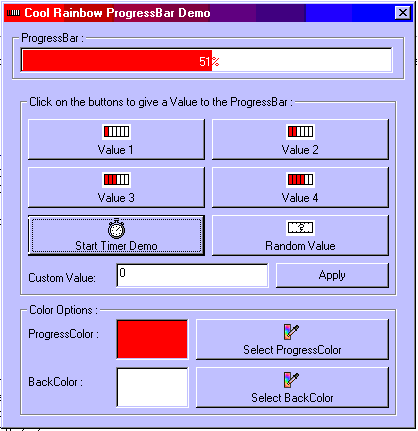



## RAINBOW PROGRESS BAR \(like in InstallShield\)

### Description

Tired of using the ProgressBar control?

This Example shows you how to create your very own ProgressBar with FREE selectable BackColor and FREE selectable ForeColor. Enjoy! AND VOTE FOR ME!!!
 
### More Info
 

             |
---                |---
**Submitted On**   |2000-07-28 14:54:34
**By**             |[Druid Developing](https://github.com/Planet-Source-Code/PSCIndex/blob/master/ByAuthor/druid-developing.md)
**Level**          |Beginner
**User Rating**    |4.3 (13 globes from 3 users)
**Compatibility**  |VB 5\.0, VB 6\.0
**Category**       |[Custom Controls/ Forms/  Menus](https://github.com/Planet-Source-Code/PSCIndex/blob/master/ByCategory/custom-controls-forms-menus__1-4.md)
**World**          |[Visual Basic](https://github.com/Planet-Source-Code/PSCIndex/blob/master/ByWorld/visual-basic.md)
**Archive File**   |[CODE\_UPLOAD8505822000\.zip](https://github.com/Planet-Source-Code/druid-developing-rainbow-progress-bar-like-in-installshield__1-10313/archive/master.zip)

### API Declarations

NONE!!!

